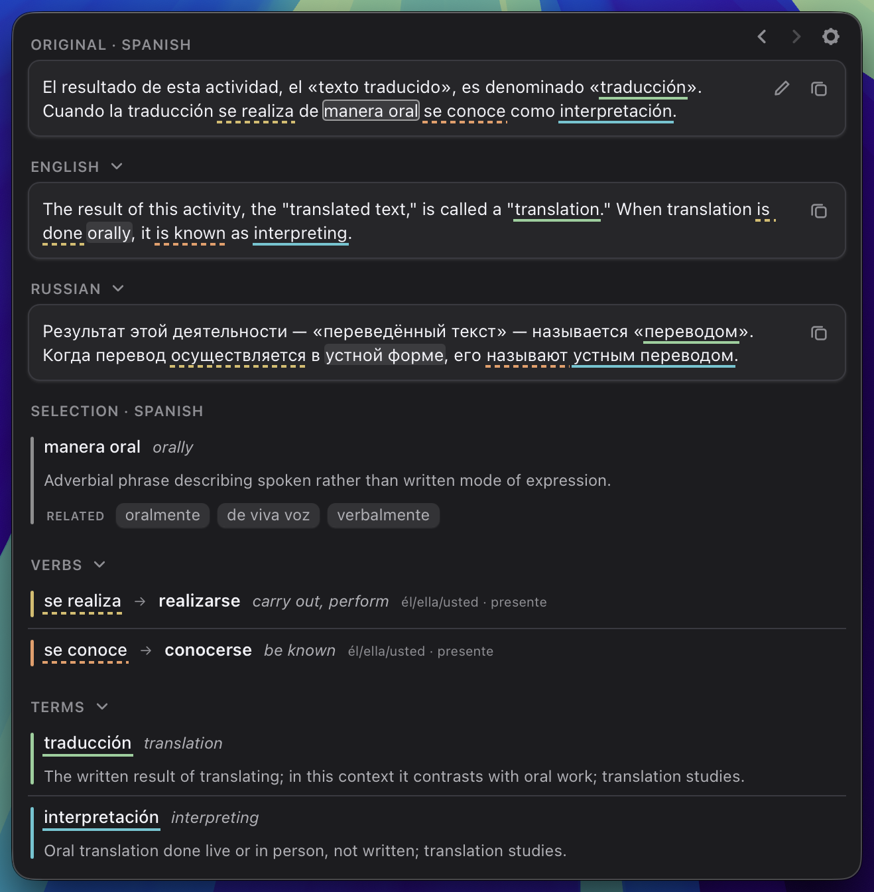

# Triglosa

Triglosa is an AI-powered translation app, made for language learners.

Copy a sentence in any language anywhere on your Mac, press a
shortcut, and Triglosa shows it next to one or two translations in the languages of your choice. The words worth
learning are explained: difficult terms, verb forms, synonyms and abbreviations,
highlighted in every panel at once. Click any word for its meaning and base
form, or turn it into a flashcard which you can export directly to Anki.



Supported languages so far: English, German, Spanish, French, Italian, Portuguese,
Russian and Arabic.

## Installing

**You need a Mac with Apple silicon (M1 or newer) and macOS 26 or newer.**

1. Download `Triglosa-…-arm64.dmg` from the
   [latest release](https://github.com/mdd335/triglosa/releases/latest).
2. Open it and drag Triglosa into Applications.
3. Open Triglosa. macOS will refuse the first time — see below.

### "Apple could not verify Triglosa"

This warning is expected. Apple only vouches for apps whose authors pay for a
developer account (€99 a year) and send every version in for checking. Triglosa
is a free hobby project and does neither. The warning says nothing about what
the app does, only that Apple has not looked at it. The source code is all
here to look at instead.

To open it anyway:

1. Open Triglosa once and close the warning with **Done**.
2. Open **System Settings → Privacy & Security**
   and scroll to the bottom. Next to "Triglosa was blocked" click
   **Open Anyway** and confirm with your password.
3. Open Triglosa again and confirm once more. From then on it opens normally.

If macOS instead says the app **"is damaged and can't be opened"**, open
Terminal and paste this, then open Triglosa again:

```bash
xattr -dr com.apple.quarantine /Applications/Triglosa.app
```

## First steps

1. **By default, Triglosa lives in the menu bar**, not in the dock. The book symbol there
   brings the window back, translates the copied text, opens the settings, checks for updates, or quits.
2. **Set your languages** in the settings: your own language (English or German), which is also the interface language, and one or two
   you are learning, each with a level from A1 to C2.
3. **Set up an AI model**, see below. It translates and explains.
4. **You are all set! Copy a sentence in any program (⌘C) and press ⌃⌥E.** Pressed with
   nothing new copied, the window comes back as you left it. You can also type
   or paste straight into the window.
5. **Optional: use selected text directly.** Translate selected text without
   copying it first, and insert translations straight into other programs.
   For this, Triglosa needs the macOS permission *Accessibility*, which you
   can grant in the settings. Triglosa uses it only for reading the selection and for inserting, and
   only when you press the shortcut or click Insert.
6. **Optional: set up Apple's on-device translation as an alternative.** It is very fast and works
   offline, but is often imprecise. In the settings under *Translations*,
   download the language packs and choose who translates by default. If one of the
   two cannot translate, the other steps in.

## What it does

- **Translations side by side**, in two or three panels following your
  language list.
- **Difficult terms and verb forms** are listed under the panels and marked in
  all of them. A verb opens its conjugation table or a web search.
- **Click any word** for its meaning, base form and related words, and ask for
  a longer explanation of it if you want one.
- **Rest the pointer on a word** of a foreign panel to see what it is in your
  language; the matching words light up in every panel.
- **Flashcards** from any word: edit the card, let the AI model improve it
  with the wand at the top, then copy it, or send it directly to
  [Anki](https://apps.ankiweb.net) with the
  [AnkiConnect](https://ankiweb.net/shared/info/2055492159) add-on (you can switch this on in the settings).
- **Example sentences** for a verb, a term or a clicked word, and a web search for it, each one click away.
- **Insert a translation** into the program you are in, with the Insert button. If text is selected there, it is replaced. Needs the optional permission from *First steps*; without it, use Copy.
- **The last five readings** are one click back, and are kept in memory only.

## Setting up an AI model

> If any of this is still unclear after reading or you have problems with the setup, paste this whole section into the AI chatbot of your
> choice and ask it to walk you through getting access step by step.

Triglosa's translations and everything else come from an AI model: what words in the text mean, which verb form is standing there and what its
base form is, related words, and the dictionary entries. Without one, only
Apple's translation on your Mac is left, if you set it up.

Triglosa does not ship an AI model and downloads none. It sends its
questions to one you choose, and there are two ways to have one.

**In the cloud** the model runs on a provider's machines. You create an account
there, generate an API key — a long string of characters, similar to a password — and paste it into
the settings. That takes a few minutes, the answers are fast and good, and
billing is usually per request. Triglosa's questions are short, so this usually comes to
a few cents a month. Providers that speak the common OpenAI-compatible
interface include [OpenRouter](https://openrouter.ai), DeepSeek, Groq, Mistral and OpenAI itself.

**Locally** the model runs on your own machine, provided that your Mac has enough memory. Install a program such as
[LM Studio](https://lmstudio.ai) or [Ollama](https://ollama.com), download a
model in it — several gigabytes — and start its built-in server. That costs
nothing, no text leaves your machine and no API key is needed. In exchange it is
a bit slower and small models answer less precisely.

Three things then go into the settings. The **endpoint** is the address Triglosa
sends its questions to; it almost always ends in `/v1`. The **model** is that
provider's name for the model, for example `deepseek/deepseek-v4.1-flash` in the cloud. If left empty, Triglosa takes the first model the
endpoint offers. The **key** is only needed with a cloud provider, and it goes
into your macOS keychain, never into a file. **Test connection** says
straight away whether it all works.

### Which model should I choose?

What suits this app is a small or medium-sized,
fast model that does not think first. A model that insists on thinking first is
refused by the app, because it is slow and you pay for every word of it.

These two were measured over everyday translations in all eight languages:

| | Quality | a full reading takes | 100 readings cost |
|---|---|---|---|
| `deepseek/deepseek-v4.1-flash` (via OpenRouter, with routing set to choose the fastest provider) | very good | around 4 seconds | around 0.15 € |
| `gemma-4-e4b-it` (via LM Studio) | acceptable, with some mistakes | around 6 seconds | nothing |


## Privacy

Triglosa sends the text you read to the AI model you set up, and nowhere else.
Apple's on-device translation, if you set it up, runs on your Mac. Your readings are not written to any file, and
the API key is kept in the macOS keychain.

If you use a cloud model from OpenRouter, you can limit your account to using only providers with Zero Data Retention (ZDR). This works with `deepseek-v4.1-flash` and many other models.

## Uninstalling

Quit Triglosa from the menu bar symbol and move it to the Bin. To remove every
trace, also delete the folder `~/Library/Application Support/de.mdd335.triglosa`,
the keychain entry named `Triglosa` (in Keychain Access), and Triglosa's entry
under System Settings → Privacy & Security → Accessibility.

## If you encounter a problem or have an idea

Please [open an issue](https://github.com/mdd335/triglosa/issues). Ideally, add which
languages you use and which AI model. Note that many surprises may come from
the model rather than from the app.

## Building the app yourself

Needs Xcode's command line tools, Node and Rust.

```bash
npm install
npm run release     # translation helper, signed Triglosa.app and the dmg
```

The app lands in `src-tauri/target/release/bundle/macos/`, the disk image in
`…/bundle/dmg/`. Use `npm run bundle` rather than `tauri build` for the app
alone: the signature it adds is what the Accessibility permission is granted
to, and without it the permission is lost with every rebuild.

```bash
npm run app                   # the window with live reload
npm test                      # the tests, no external services
cd src-tauri && cargo test    # the shell's own
```

Before changing anything, read [docs/DEVELOPMENT.md](docs/DEVELOPMENT.md).

## License

MIT
