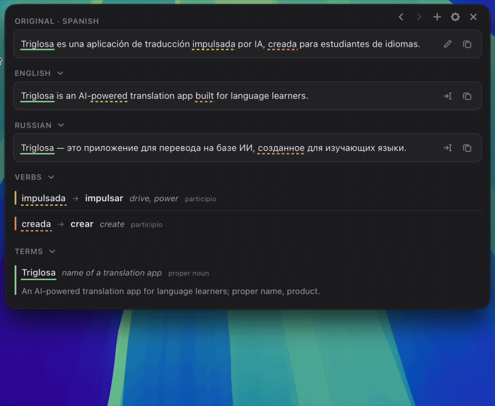

# Triglosa

Triglosa is an AI-powered translation app, made for language learners.

Select some text in any language anywhere on your PC or Mac, press a
shortcut, and Triglosa shows it next to one or two translations in the
languages of your choice.



**What makes Triglosa different**

- **No need to pick languages every time.** Triglosa recognizes the language on its own and
  translates into the language(s) relevant for you, according to your settings.
- **Translation on hover.** Point at any word to see what it became in your
  language. This is worked out on your own computer.
- **Every word is clickable** for translations, explanations, base forms,
  synonyms and example sentences.
- **AI-enhanced flashcards from any word**, in Triglosa or straight from a
  word you select in any other app, sent to Anki with one click.
- **Made for your level.** It highlights the words that are hard at your
  level, from A1 to C2.
- **Your choice of AI model:** any cloud service, or a local model so your
  texts never leave your computer.

**Supported languages**

Triglosa translates text from any language the AI model knows.
Your own language and the languages you are learning can be:

- English, Spanish, French, German, Portuguese, Russian and Italian
- Arabic, for now only as a language you learn

Feel free to
[open an issue](https://github.com/mdd335/triglosa/issues) if your language is missing.

## Downloading and installing

### Installing on Windows

**You need Windows 11 on a PC with an Intel or AMD processor.** Windows 10
probably works, but has not been tested.

1. Download [Triglosa for Windows](https://github.com/mdd335/triglosa/releases/latest/download/Triglosa-Windows-Setup.exe).
2. Open it. Windows will warn you the first time: Triglosa is not signed. This warning is expected. Click **More info**, then **Run anyway**.
3. Install, and open Triglosa from the Start menu.

### Installing on Mac

**You need macOS 26 or newer.**

1. Download Triglosa for [Macs with an M1 chip or newer](https://github.com/mdd335/triglosa/releases/latest/download/Triglosa-Apple-Silicon.dmg)
   or for [older Macs with an Intel chip](https://github.com/mdd335/triglosa/releases/latest/download/Triglosa-Intel.dmg).
   Which one you have is shown under  → About This Mac.
2. Open it and drag Triglosa into Applications.
3. Open Triglosa. macOS will refuse the first time — see below.

#### "Apple could not verify Triglosa"

This warning is expected. Apple only vouches for apps whose authors pay for a
developer account and send every version in for checking. Triglosa
is a free hobby project and does neither.

To open it anyway:

1. Open Triglosa once and close the warning with **Done**.
2. Open **System Settings → Privacy & Security**
   and scroll to the bottom. Next to "Triglosa was blocked" click
   **Open Anyway** and confirm with your password.
3. Open Triglosa again and confirm once more. From then on it opens normally.

If macOS instead says the app **"is damaged and can't be opened"**, open
Terminal and paste this, then open Triglosa again:

```bash
xattr -dr com.apple.quarantine /Applications/Triglosa.app
```

## First steps

1. **Triglosa lives in the notification area at the bottom right (Windows) or in the menu bar (Mac).** Its menu (on Windows with a
   right click) brings the window back, translates the selected text, opens the settings, checks for updates, or quits.
2. **Set your languages** in the settings: your own language, which is also the interface language, and one or two
   you are learning, each with a level from A1 to C2. The level decides which words Triglosa explains, and how explanations, example sentences and flashcards are written.
3. **Connect an AI model**, see below.
4. **You are all set! Select a sentence in any program and press Win+Shift+E (Windows) or ⌃⌥E (Mac).**
   Triglosa translates it. Pressed with nothing selected, the window comes back as you left it. You can also type
   or paste straight into the window. On a Mac, copy the sentence first (⌘C), unless you allow step 5.
5. **Optional, Mac only: grant the macOS permission.** With it, Triglosa can read selected text without
   you copying it first, read the word or the sentence under the pointer, and insert translations straight into other programs.
   The permission is called *Device Control and Data Access* (under Privacy & Security; *Accessibility* up to macOS 26), and you
   can grant it in the settings under *Text from other programs*. Triglosa uses it only for these features and only when you switch them on.
6. **Optional, Mac only: download the relevant language packs for Apple's on-device translation.** It is part of macOS and
   needs a pack per pair of languages. With the packs downloaded, Triglosa falls back to Apple whenever the AI model does not answer. Under *Translations* in the settings you can download the missing ones and make Apple translate by default. It is very fast, but often imprecise.

## Connecting an AI model

> Never set up an AI model before? No problem! You can paste this whole section into the AI chatbot of your
> choice and ask it to walk you through step by step.

Triglosa's translations and other features come from an AI model: explanations, verb forms, base forms, related words and more.

Triglosa does not ship an AI model and downloads none. It sends its
questions to one you choose, in the cloud or on your own computer. Quality and cost depend on the model.

**In the cloud** the model runs on a provider's machines. You create an account
there, deposit a few euros, generate an API key — a long string of characters, similar to a password — and paste it into
the settings. Billing is usually per request. Triglosa's questions are short, so this usually comes to
a few cents a month. Providers that speak the common OpenAI-compatible
interface include [OpenRouter](https://openrouter.ai), Groq, DeepSeek, Anthropic, Mistral and OpenAI itself.

**Locally** the model runs on your own machine, provided that your computer has enough memory. Install a program such as
[LM Studio](https://lmstudio.ai) or [Ollama](https://ollama.com), download a
model in it — several gigabytes — and start its built-in server. That costs
nothing, no text leaves your machine and no API key is needed. In exchange, small models answer less precisely.
The server may also run on another computer in your own network; its address then starts with that computer's name or IP address, for example `http://192.168.1.20:1234/v1`.

Three things then go into the settings:

- The **AI model's address** is where Triglosa sends its questions; it almost always ends in `/v1`.
- The **model** is that provider's name for the model, for example `deepseek/deepseek-v4.1-flash` in the cloud.
  If left empty, Triglosa takes the first model offered at that address.
- The **API key** is only needed with a cloud provider.

Click **Test connection** to see whether the model answers.

### Which model should I choose?

What suits this app is a fast model that does not think first: typically a "flash" or "mini" model in the cloud, or a small model locally. The app asks every model not to think, and a model that cannot be kept from thinking usually will not work.

These were measured:

| Model | Runs on | OpenRouter: routing set to | Quality | Translation appears after around | 100 translations cost around |
|---|---|---|---|---|---|
| `deepseek/deepseek-v4.1-flash` | OpenRouter | Throughput | 95 % | 0.8 s | € 0.04 |
| `deepseek/deepseek-v4.1-flash` | OpenRouter | Default | 95 % | 1 s | € 0.03 |
| `openai/gpt-6-luna` | OpenRouter | Default | 95 % | 4 s | € 0.03 |
| `google/gemma-4-26b-a4b-it` | OpenRouter | Latency | 93 % | 1.3 s | € 0.03 |
| `google/gemma-4-26b-a4b-it` | OpenRouter | Default | 93 % | 1.7 s | € 0.03 |
| `gemma-4-e4b-it` | LM Studio on an M2 MacBook Pro | | 83 % | 6.5 s | € 0 |

All measurements were made in September 2026, with texts in all eight languages. Cloud models were used through ZDR providers only (see [Privacy](#privacy)). Time and cost are an even mix of looking up a word or short phrase (dictionary mode) and translating a text of about 20 words into two languages. The time runs until the translations appear; terms and verbs follow afterwards. The cost covers everything such a translation asks the AI model.

## What Triglosa does

### How to open Triglosa

There are several ways to open Triglosa:

- **Select text and press the shortcut** to translate it: Win+Shift+E (Windows) or ⌃⌥E (Mac). You can change the shortcut in the settings.
- **Click the book symbol** in the notification area (Windows) or the menu bar (Mac). Its menu (on Windows with a
  right click) offers more options like starting a new translation or opening the settings.
- **Optional: point instead of selecting.** With a shortcut of your choice, Triglosa translates the word or the whole sentence
  under the mouse pointer. On a Mac, a firm click on the trackpad (Force Click) can look up a word, too. Set these up
  in the settings under *Text from other programs*.

### Dictionary mode

For three words or fewer:

- **Up to three translations** per language, with a short note where their use differs.
- **The meaning that fits your text comes first:** the sentence around the word goes along to the AI model, at most 30 words
  (on a Mac with the optional permission from *First steps*).
- **An explanation below the translations**, where the word or the expression it belongs to is hard at your level.

### Translation mode

For four words or more:

- **Translations side by side**, in the languages you set, next to the original.
- **Point at a word** in a foreign language to see its translation. The matching words light up in every translation.
- **Words and verb forms that are difficult at your level** are listed below the translations and highlighted in all
  of them.
- **Optional: read on sentence by sentence.** Switch on *Offer the next sentence* in the settings under *Text from other programs*, and the next sentence of the text you read from is shown under the original. Click it to
  translate it.

### In both modes

- **Click any word** for its meaning, dictionary form and related words. A longer explanation, example sentences or a web search are one click away.
- **Hear a word** spoken aloud with the loudspeaker button. (On Windows, add a voice for each language you learn under
  Settings → Time & language → Speech.)
- **Insert a translation** straight into the program you came from, replacing the text you selected there. (On a Mac
  this needs the optional permission from *First steps*.)
- **Go back to your last five translations.** They are kept until you quit Triglosa. The settings make it ten, or none.
- **Most parts of the window** can be customized or switched off in the settings.

### Creating flashcards

- **Make a flashcard from any word** in the Triglosa window, or straight from text you select in any program, with a
  shortcut of its own.
- **The AI model improves every card** as it opens: it puts the word in its dictionary form and adds an explanation
  with examples. You can undo this on the card, or switch it off in the settings.
- **Edit the card if necessary**, then copy it, or send it straight to [Anki](https://apps.ankiweb.net) with the
  [AnkiConnect](https://ankiweb.net/shared/info/2055492159) add-on (switch this on in the settings).

## Privacy

Triglosa sends the text you read to the AI model you connect, and nowhere else. Your readings are not written to any file, and
the API key is kept in the Windows Credential Manager or the macOS keychain.

A looked-up word takes the sentence it stands in along, at most 30 words, even though you did not select that sentence. Switch off *Send the sentence along* in the settings under *Text from other programs* if you do not want that.
The next sentence shown under the original is read on your computer and sent only when you click it.

If you use a cloud model from OpenRouter, you can limit your account to providers with Zero Data Retention (ZDR). This works with `deepseek-v4.1-flash` and many other models.

Text to speech runs on your device, and so does Apple's on-device translation, if it is used on a Mac.

## If you encounter a problem or have an idea

A newer version may fix it: in the settings under *About Triglosa*, **Check for updates** finds one and installs it with one click.

If not, please [open an issue](https://github.com/mdd335/triglosa/issues) and paste what
**Copy diagnostics**, in the same place, puts on the clipboard: version, system, languages
and AI model, none of your texts. Note that many surprises may come from
the model rather than from the app.

## Uninstalling

**Windows:** quit Triglosa from its symbol in the notification area and uninstall it under
Settings → Apps. To remove every trace, also delete the folder `%APPDATA%\de.mdd335.triglosa`
and the entry `Triglosa/model-endpoint` in the Credential Manager.

**Mac:** quit Triglosa from the menu bar symbol and move it to the Bin. To remove every
trace, also delete the folder `~/Library/Application Support/de.mdd335.triglosa`,
the keychain entry named `Triglosa` (in Keychain Access), and Triglosa's entry
under System Settings → Privacy & Security → Device Control and Data Access (Accessibility up to macOS 26).

## Building the app yourself

Needs Node and Rust, and Visual Studio's C++ build tools (Windows) or Xcode's command line tools (Mac).

```bash
npm install
npm run app                   # the window with live reload
npm test                      # the tests, no external services
cd src-tauri && cargo test    # the shell's own
```

**Windows:** `node scripts/aligner-fetch.mjs`, then `npx tauri build --bundles nsis` builds the installer into
`src-tauri/target/release/bundle/nsis/`.

**Mac:** `npm run release` builds the translation helper, the signed app in
`src-tauri/target/release/bundle/macos/` and the disk image in `…/bundle/dmg/`.
Use `npm run bundle` rather than `tauri build` for the app alone: the signature
it adds is what the Device Control and Data Access permission is granted to,
and without it the permission is lost with every rebuild.

Before changing anything, read [docs/DEVELOPMENT.md](docs/DEVELOPMENT.md). What happens behind a translation, and which requests go to the AI model: [docs/behind-a-translation.md](docs/behind-a-translation.md).

## License

MIT

The app includes two small models, each with its notice and license in a folder inside the app: one for matching words between a text and its translation, derived from
[OmniAlign](https://huggingface.co/WPS-Qingqiu/OmniAlign) (Apache License 2.0, folder `aligner`), and one for recognizing a text's language, derived from
[fastText's language identification model](https://fasttext.cc/docs/en/language-identification.html) (Creative Commons Attribution-Share-Alike 3.0, folder `identifier`).
