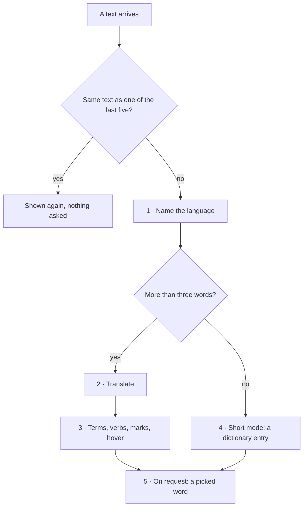
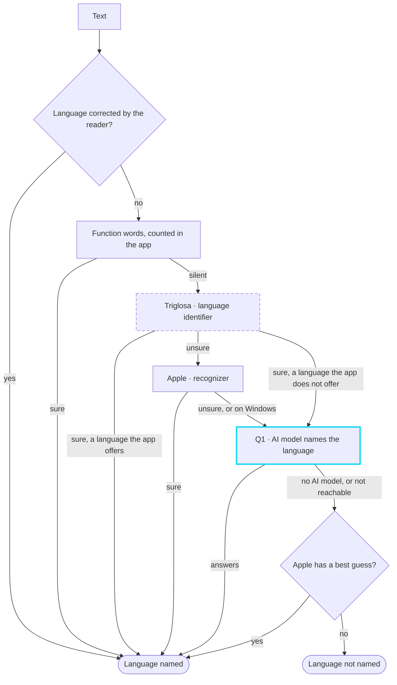
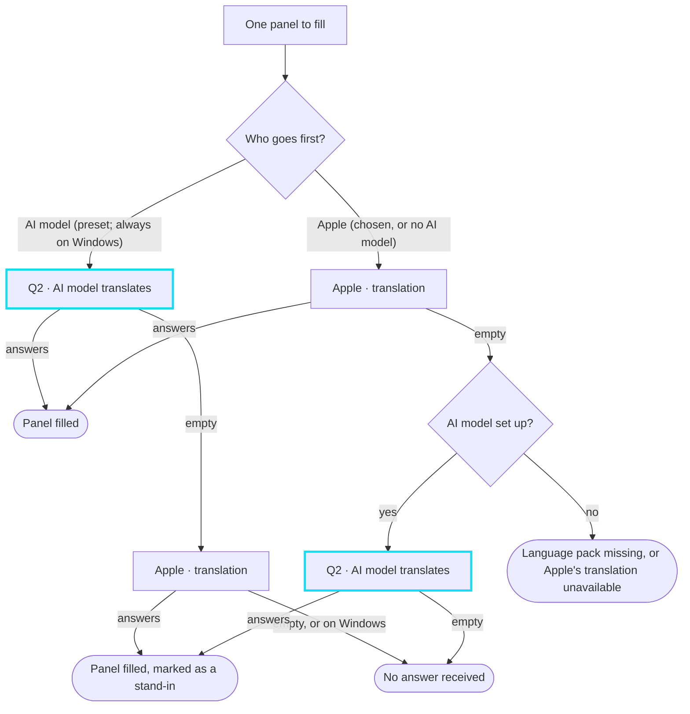
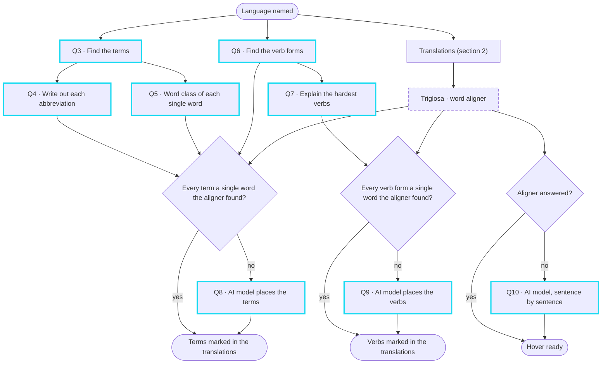
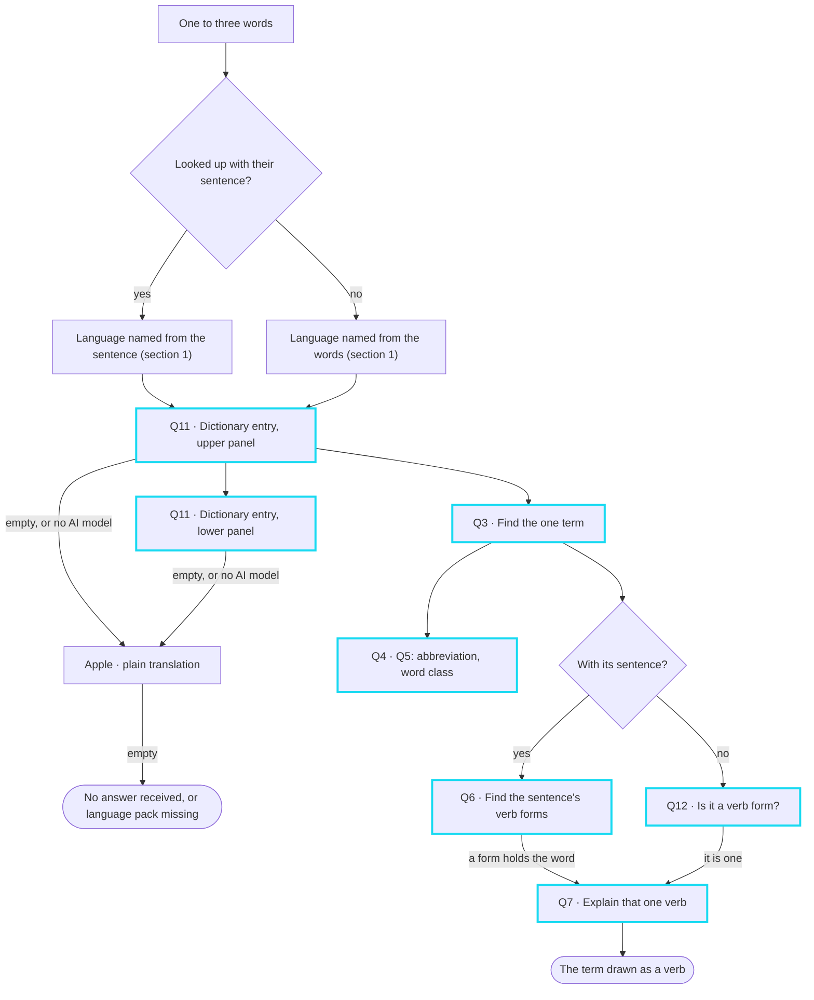
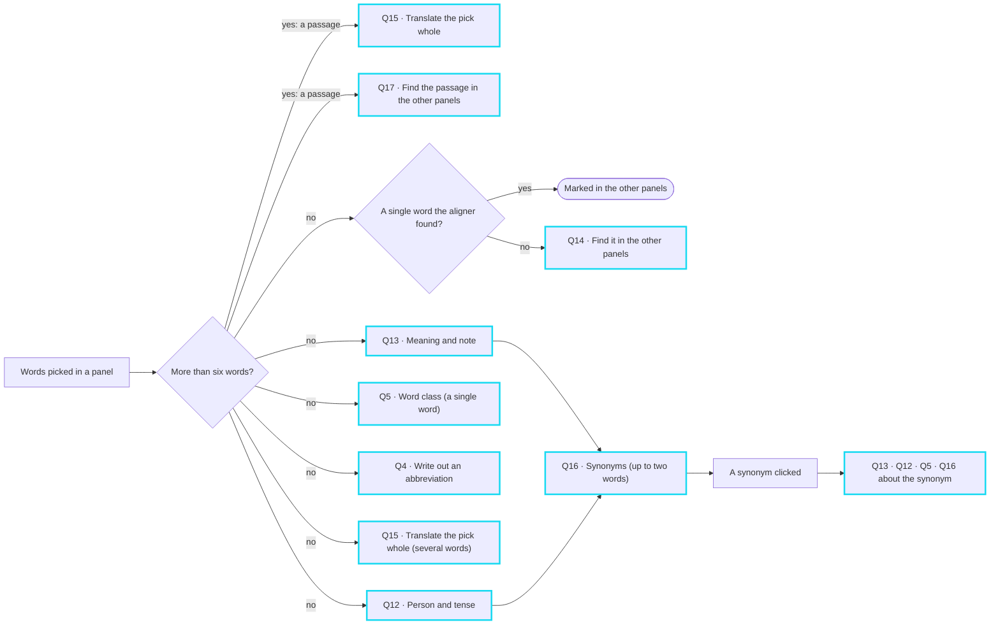
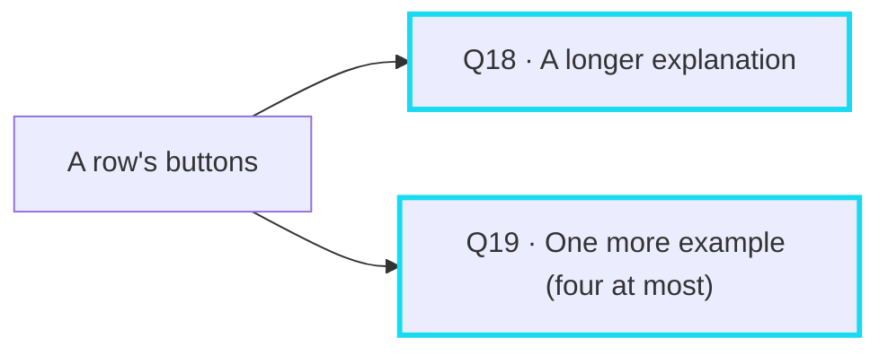

# What happens behind a translation

Who is asked what, from the moment a text arrives until the sheet is
complete — and who answers instead where the first one cannot.

Three kinds of helper do the work, and every box below names its own:

| | Who | Where it runs |
|---|---|---|
| **Q1 … Q19** | the **AI model** set up in the settings | wherever its endpoint is — the only requests that leave the app |
| **Triglosa** | two small models that come with the app: the language identifier and the word aligner | on this machine |
| **Apple** | the system's recognizer and translation | on this machine, Mac only |

Every request to the AI model has a number. The [table at the end](#every-request-to-the-ai-model)
lists them all.

## The whole way

## 1 · Naming the language

Four stages, cheapest first. Each may stay silent, and only then is the next
one asked.

- A language the app has no pack for keeps its name and is still translated
  by the AI model; the terms are asked, the verbs and the hover are not.
- Not named and no AI model: the panels say so, and nothing else happens.

## 2 · Translating

One translation per panel. A setting decides who goes first; the other steps
in wherever the first comes back empty, and the panel's heading says so.
The AI model translates both panels side by side, Apple one after the other.

Without an AI model the run ends here — except for the hover, which the word
aligner works out by itself (next section).

## 3 · Below the translations

Three strands start together with the translations and wait only on what
they need. The terms and verbs are asked of the AI model; where they ended up
in the translations is worked out on the machine wherever it can be.

- Terms or verbs switched off in the settings are neither asked nor drawn.
- Where Q8 or Q9 is asked, the aligner's places are kept for the single
  words, and it says which occurrence is meant where a word stands twice.
- The aligner cannot answer where a translation does not come apart into the
  same sentences as the source text, or where its model is not there.
- The hover never asks while the pointer rests on a word: it is worked out
  beforehand, and gives way to a word the reader clicks meanwhile.

## 4 · Short mode: up to three words

A dictionary entry per panel instead of a translation, and at most one term
below it. The AI model goes first here whatever the translator setting says.

The lower panel's entry and the term are asked side by side, after the upper
panel's entry has arrived. Nothing is placed in the translations and no hover
is worked out: the panels hold lists, not sentences.

## 5 · On request

Nothing here is asked until the reader clicks.

And on every row — a term, a verb, a picked word — two buttons:

The questions about a picked word go out together; only the synonyms wait,
for the base form the meaning's answer brings. A picked word needs the AI
model: without one the area is not drawn. A synonym already looked up, and a
step back along the synonyms, asks nothing again.

## Every request to the AI model

| | Asks for | When | How many | Who answers otherwise |
|---|---|---|---|---|
| Q1 | the language of the text (its first 600 characters) | function words, identifier and Apple's recognizer were all unsure — or the identifier is sure of a language the app does not offer | 1 | Apple's best guess; else the language stays unnamed |
| Q2 | the translation of the whole text | the AI model goes first, or Apple came back empty | 1 per panel | Apple's translation (Mac) |
| Q3 | the difficult terms, up to three, each with a meaning and a note | terms switched on; in short mode held to one term | 1; once more where the notes came back in the wrong language, or only loanwords were found | nobody — the section is not drawn |
| Q4 | an abbreviation written out | a term or a picked word looks like an abbreviation | 1 each | nobody — the row stands without it |
| Q5 | the word class | a term or a picked word is a single word, or one with its article | 1 each | nobody |
| Q6 | every verb form in the text | verbs switched on; in short mode on the looked-up word's sentence | 1 | nobody — the section is not drawn |
| Q7 | base form, meaning, person and tense of the hardest forms | Q6 found any | 1 | nobody |
| Q8 | where the terms went in the translations | a term is several words, or the aligner has no place for it | 1 | the word aligner, for single words |
| Q9 | where the verb forms went in the translations | a form is several words, or the aligner has no place for it | 1 | the word aligner, for single words |
| Q10 | what each word of a sentence became, for the hover | the aligner could not answer | 1 per sentence, three at a time | the word aligner, as a rule |
| Q11 | a dictionary entry: up to three translations with notes | short mode | 1 per panel | Apple's plain translation (Mac) |
| Q12 | person and tense, or that it is no verb form | a picked word; a looked-up word without its sentence | 1 | nobody |
| Q13 | meaning and note of a picked word | a word is picked, or a synonym clicked | 1; once more where the note came back in the wrong language | nobody |
| Q14 | where a picked word stands in the other panels | not a single word the aligner found; not in short mode | 1 | the word aligner, for single words |
| Q15 | the pick translated whole | several words picked, not in the reader's own language | 1 | nobody |
| Q16 | synonyms | a pick of up to two words | 1 | nobody |
| Q17 | where a passage stands in the other panels | more than six words picked | 1 | nobody |
| Q18 | a longer explanation | its button | 1 | nobody |
| Q19 | one more example sentence | its button | 1 | nobody |

For a text of a few sentences with everything switched on and the aligner
answering, that comes to about ten requests: two translations, the terms with
a word class or two, two for the verbs, and one or two to place whatever is
several words.

Every request asks the model not to think. A rate limit or a server error is
waited out twice; a wrong key or address answers at once.
